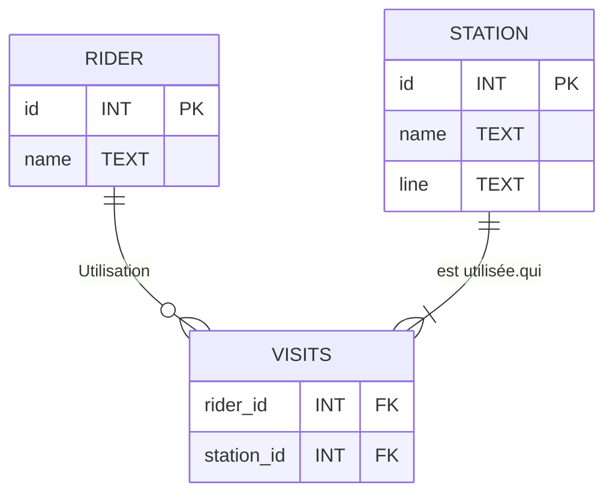

## Cours 3

## Introduction

- Nous allons apprendre à concevoir nos propres schémas de base de données.
- Jusqu'à présent, nous avons principalement travaillé avec une base de données déjà crée. Maintenant, nous allons examiner ce qui se passe sous le capot et voir quelles commandes peuvent être utilisées pour créer une telle base de données.
- Commençons par ouvrir la base de données `longlist.db` de la Semaine 0 sur notre terminal. Pour rappel, cette base de données contenait une seule table, appelée `longlist`. Pour voir un aperçu de la table, nous pouvons exécuter :

```sql
SELECT "author", "title"
FROM "longlist"
LIMIT 5;
```

Cela nous donne les auteurs et titres des 5 premières lignes de la table `longlist`.
- Voici une commande SQLite (pas un mot-clé SQL) qui peut éclairer comment cette base de données a été créée :

```sql
.schema
```

En exécutant cette commande, nous voyons l'instruction SQL utilisée pour créer la table `longlist`. Cela nous montre les colonnes à l'intérieur de `longlist` et les types de données que chaque colonne est capable de stocker.
- Ensuite, ouvrons la même base de données de la Semaine 1 sur notre terminal. Cette version de `longlist.db` contenait différentes tables liées entre elles.
- En exécutant à nouveau `.schema`, nous voyons plusieurs commandes — une pour chaque table de la base de données. Il existe un moyen de voir le schéma pour une table spécifiée :

```sql
.schema books
```

Maintenant, nous voyons l'instruction utilisée pour créer la table `books`. Nous pouvons également voir les colonnes et les types de données pour chaque colonne. Par exemple, la colonne `"title"` prend du texte et la colonne `"publisher_id"` est un entier.

## Création d'un Schéma de Base de Données

- Maintenant que nous avons vu le schéma d'une base de données existante, créons le nôtre ! Nous devons représenter le système de métro de la ville de Boston à travers un schéma de base de données. Cela inclut les stations de métro, les différentes lignes de train, et les personnes qui prennent les trains.


- Pour décomposer la question, nous devons décider :
  - quels types de tables nous aurons dans notre base de données du métro de Boston,
  - quelles colonnes chacune des tables aura, et
  - quels types de données nous devons mettre dans chacune de ces colonnes.

### Normalisation

- Observons cette première tentative de création d'une table pour représenter les données du métro de Boston. Cette table contient les noms des usagers du métro, les stations actuelles où se trouvent les usagers et l'action effectuée à la station (comme entrer et sortir). Elle enregistre également les tarifs payés et les soldes sur leurs cartes de métro. Cette table contient également un ID pour chaque "transaction" d'usager, qui sert de clé primaire.


- Quelles redondances existent dans cette table ?
  - Nous pourrions séparer les noms des usagers dans une table à part, pour éviter de dupliquer les noms autant de fois. Nous devrions donner à chaque usager un ID qui peut être utilisé pour relier la nouvelle table à celle-ci.
  - De même, nous pourrions déplacer les stations de métro dans une table différente et donner à chaque station de métro un ID à utiliser comme clé étrangère ici.
- Le processus de séparation de nos données de cette manière s'appelle la normalisation. Lors de la normalisation, nous mettons chaque entité dans sa propre table — comme nous l'avons fait avec les usagers et les stations de métro. Toute information sur une entité spécifique, par exemple l'adresse d'un usager, va dans la table de l'entité elle-même.

### Relation

- Nous devons maintenant décider comment nos entités (usagers et stations) sont liées. Un usager visitera probablement plusieurs stations, et une station de métro aura probablement plus d'un usager. Étant donné cela, ce sera une relation plusieurs-à-plusieurs.
- Nous pouvons également utiliser un diagramme ER (Entity-Relationship) pour représenter cette relation.


Ici, nous voyons que chaque usager doit visiter au moins une station pour être considéré comme un usager. Une station, cependant, pourrait n'avoir aucun usager la visitant, car elle pourrait être temporairement hors service. Cependant, il est probable qu'une station ait plusieurs usagers la visitant, indiqué par la patte-d'oie dans le diagramme ER.

### Questions

> La relation entre les usagers et les stations doit-elle être exactement comme décrite ici ? Par exemple, pourquoi est-il acceptable qu'une station n'ait aucun usager ?

- C'est à la personne qui conçoit la base de données de prendre des décisions sur les relations entre les entités. Il est possible d'ajouter une contrainte qui dit qu'une station doit avoir au moins un usager pour être considérée comme une station.

## `CREATE TABLE`

- Maintenant que nous avons le schéma pour deux des tables, allons-y et créons les tables.
- Ouvrons une nouvelle base de données appelée `mbta.db` — MBTA signifie Massachusetts Bay Transportation Authority et gère le métro de Boston.
- Si nous exécutons `.schema`, nous ne verrons rien car aucune table n'a encore été créée dans cette base de données.
- Dans cette base de données, exécutons la commande suivante pour créer la première table pour les usagers :

```sql
CREATE TABLE riders (
    "id",
    "name"
);
```

En exécutant cela, aucun résultat n'apparaît sur le terminal. Mais si nous exécutons à nouveau `.schema`, nous verrons maintenant le schéma pour la table `riders`, tel que nous l'avons défini !
- De même, créons une table pour les stations également.

```sql
CREATE TABLE stations (
    "id",
    "name",
    "line"
);
```

Ici, nous ajoutons une colonne `"line"` pour stocker la ligne de train à laquelle appartient la station.
- `.schema` nous montre maintenant le schéma pour `riders` et `stations`.
- Ensuite, nous allons créer une table pour relier ces deux entités. Ces tables sont souvent appelées tables de jonction, entités associatives ou tables de jointure !

```sql
CREATE TABLE visits (
    "rider_id",
    "station_id"
);
```

Chaque ligne de cette table nous indique la station visitée par un usager particulier.

### Questions

> Est-il nécessaire d'indenter les lignes dans les parenthèses `CREATE TABLE` ?

- Non, pas strictement. Cependant, nous indentons les noms des colonnes pour adhérer aux conventions de style comme toujours !

## Types de Données et Classes de Stockage

- SQLite a cinq classes de stockage :
  - `Null` : rien, ou valeur vide
  - `Integer` : nombres sans points décimaux
  - `Real` : nombres décimaux ou à virgule flottante
  - `Text` : caractères ou chaînes de caractères
  - `Blob` : Binary Large Object, pour stocker des objets en binaire (utile pour les images, l'audio, etc.)
- Une classe de stockage peut contenir plusieurs types de données.
- Par exemple, voici les types de données qui relèvent de la classe de stockage Integer.


SQLite prend soin de stocker la valeur d'entrée sous le bon type de données. En d'autres termes, nous, en tant que programmeurs, n'avons besoin que de choisir une classe de stockage et SQLite fera le reste !
- Considérons cette question : quelle classe de stockage utiliserions-nous pour stocker les tarifs ? Chaque choix a ses avantages et ses limitations.
  - Integers : Nous pouvons stocker un tarif de 10 centimes comme le nombre 10, mais cela ne rend pas très clair si le tarif est de 10 centimes ou de 10 dollars.
  - Text : Nous pouvons stocker le tarif en texte, comme "$0.10". Cependant, il sera alors difficile d'effectuer des opérations mathématiques comme additionner les tarifs d'un usager.
  - Real : Nous pouvons stocker le tarif en utilisant un nombre à virgule flottante, comme 0.10, mais il n'est pas possible de stocker des nombres à virgule flottante en binaire de manière précise et — selon le niveau de précision dont nous avons besoin — cela pourrait entraîner des erreurs de calcul plus tard.

## Affinités de Type

- Il est possible de spécifier le type de données d'une colonne lors de la création d'une table.
- Cependant, les colonnes dans SQLite ne stockent pas toujours un type de données particulier. Elles sont dites avoir des affinités de type, ce qui signifie qu'elles essaient de convertir une valeur d'entrée dans le type pour lequel elles ont une affinité.
- Les cinq affinités de type dans SQLite sont : Text, Numeric (soit des valeurs entières soit réelles selon ce que la valeur d'entrée convertit le mieux), Integer, Real et Blob.
- Considérons une colonne avec une affinité de type pour les Integers. Si nous essayons d'insérer "25" (le nombre 25 mais stocké comme texte) dans cette colonne, il sera converti en un type de données entier.
- De même, insérer un entier 25 dans une colonne avec une affinité de type pour le texte convertira le nombre en son équivalent texte, "25".

## Ajout de Types à nos Tables

- Pour recréer les tables dans notre base de données, nous devrons d'abord supprimer (ou supprimer) les tables existantes.
- Essayons les commandes suivantes :

```sql
DROP TABLE "riders";
```

```sql
DROP TABLE "stations";
```

```sql
DROP TABLE "visits";
```

L'exécution de ces instructions ne donne aucun résultat, mais `.schema` nous montre que les tables ont maintenant été supprimées.
- Ensuite, créons un fichier de schéma qui peut être exécuté pour créer les tables à partir de zéro. C'est une amélioration par rapport à ce que nous avons fait précédemment — taper la commande `CREATE TABLE` pour chaque table — car cela nous permet de modifier et de voir tout le schéma facilement.
- Créons un fichier `schema.sql`. Remarquez l'extension `.sql` qui permet la coloration syntaxique pour les mots-clés SQL dans notre éditeur.
- À l'intérieur du fichier, tapons à nouveau les schémas, mais avec les types d'affinité cette fois.

```sql
CREATE TABLE riders (
    "id" INTEGER,
    "name" TEXT
);

CREATE TABLE stations (
    "id" INTEGER,
    "name" TEXT,
    "line" TEXT
);

CREATE TABLE visits (
    "rider_id" INTEGER,
    "station_id" INTEGER
);
```

- Maintenant, lisons ce fichier dans la base de données pour créer réellement les tables. Voici un diagramme ER mis à jour avec les types de données inclus.




### Questions

> Auparavant, nous étions capables d'interroger les tables de notre base de données et de voir les résultats dans une structure de type tableau. Comment obtenir le même type de résultats ici ?

- Nous n'avons pas encore ajouté de données aux tables. Dans le Cours 4, nous verrons comment insérer, mettre à jour et supprimer des lignes dans les tables que nous avons créées !

> Avons-nous une affinité de type pour Boolean ?

- Nous n'en avons pas dans SQLite, mais d'autres SGBD pourraient avoir cette option. Une solution de contournement pourrait être d'utiliser des valeurs entières 0 ou 1 pour représenter des booléens. Nous verrons MySQL qui a une option Boolean à la fin du cours.

## Contraintes de Table

- Nous pouvons utiliser des contraintes de table pour imposer des restrictions sur certaines valeurs dans nos tables.
- Par exemple, une colonne de clé primaire doit avoir des valeurs uniques. La contrainte de table que nous utilisons pour cela est `PRIMARY KEY`.
- De même, une contrainte sur une valeur de clé étrangère est qu'elle doit être trouvée dans la colonne de clé primaire de la table liée ! Cette contrainte de table s'appelle, de manière prévisible, `FOREIGN KEY`.
- Ajoutons des contraintes de clé primaire et étrangère à notre fichier `schema.sql`.

```sql
CREATE TABLE riders (
    "id" INTEGER,
    "name" TEXT,
    PRIMARY KEY("id")
);

CREATE TABLE stations (
    "id" INTEGER,
    "name" TEXT,
    "line" TEXT,
    PRIMARY KEY("id")
);

CREATE TABLE visits (
    "rider_id" INTEGER,
    "station_id" INTEGER,
    FOREIGN KEY("rider_id") REFERENCES "riders"("id"),
    FOREIGN KEY("station_id") REFERENCES "stations"("id")
);
```

Remarquez que nous avons créé deux colonnes de clé primaire, l'ID pour `riders` et `stations`, puis nous les avons référencées comme clés étrangères dans la table `visits`.
- Dans la table `visits`, il n'y a pas de clé primaire. Cependant, SQLite donne à chaque table une clé primaire par défaut, connue sous le nom de row ID. Même si le row ID est implicite, il peut être interrogé !
- Il est également possible de créer une clé primaire composée de deux colonnes. Par exemple, si nous voulions donner à `visits` une clé primaire composée à la fois des IDs des usagers et des stations, nous pourrions utiliser cette syntaxe :

```sql
CREATE TABLE visits (
    "rider_id" INTEGER,
    "station_id" INTEGER,
    PRIMARY KEY("rider_id", "station_id")
);
```

Dans ce cas, nous voudrions probablement permettre à un usager de visiter une station plus d'une fois, donc nous ne poursuivrions pas cette approche.

### Questions

> Est-il possible d'inclure notre propre clé primaire pour la table `visits` ?

- Oui ! Si, pour une raison quelconque, une clé primaire explicite était requise pour la table `visits`, nous pourrions créer une colonne ID et en faire la clé primaire.

## Contraintes de Colonne

- Une contrainte de colonne est un type de contrainte qui s'applique à une colonne spécifiée dans la table.
- SQLite a quatre contraintes de colonne :
  - `CHECK` : permet de vérifier une condition, comme toutes les valeurs de la colonne doivent être supérieures à 0
  - `DEFAULT` : utilise une valeur par défaut si aucune n'est fournie pour une ligne
  - `NOT NULL` : dicte qu'une valeur nulle ou vide ne peut pas être insérée dans la colonne
  - `UNIQUE` : dicte que chaque valeur dans cette colonne doit être unique
- Un schéma mis à jour avec ces contraintes ressemblerait à ce qui suit :

```sql
CREATE TABLE riders (
    "id" INTEGER,
    "name" TEXT,
    PRIMARY KEY("id"),
    CHECK (LENGTH("name") >= 3) -- Check pour forcer une taille de nom d'au moins 3 charactères
);

CREATE TABLE stations (
    "id" INTEGER,
    "name" TEXT NOT NULL UNIQUE,
    "line" TEXT NOT NULL,
    PRIMARY KEY("id")
);

CREATE TABLE visits (
    "rider_id" INTEGER,
    "station_id" INTEGER,
    FOREIGN KEY("rider_id") REFERENCES "riders"("id"),
    FOREIGN KEY("station_id") REFERENCES "stations"("id")
);
```

La contrainte `NOT NULL` garantit qu'un nom de station et une ligne sont spécifiés. D'un autre côté, les usagers ne sont pas obligés de partager leurs noms, car il n'y a pas de contrainte appliquée aux noms des usagers. De même, chaque station doit avoir un nom unique, comme dicté par la contrainte `UNIQUE`.
- Les colonnes de clé primaire et par extension, les colonnes de clé étrangère doivent toujours avoir des valeurs uniques, donc il n'y a pas besoin de spécifier explicitement les contraintes de colonne `NOT NULL` ou `UNIQUE`. La contrainte de table `PRIMARY KEY` inclut ces contraintes de colonne.

## Modification des Tables

- Considérons le diagramme ER mis à jour suivant, où l'entité "Rider" a été remplacée par une nouvelle entité "Card" utilisée pour représenter les CharlieCards. Les CharlieCards, dans le métro de Boston, peuvent être chargées avec de l'argent et sont utilisées pour passer dans et parfois hors des stations.


- Remarquez qu'une carte peut être passée plusieurs fois au total, mais seulement à une station à la fois.
- L'entité "Card" a un ID, qui est également sa clé primaire.
- Il y a maintenant aussi une entité "Swipe", avec son propre ID et un type. "Swipe" enregistre également l'heure à laquelle une carte a été passée et le montant qui a été soustrait (équivalent au montant d'argent nécessaire pour prendre le métro) !
- Maintenant, pour implémenter ces changements dans notre base de données, nous devons d'abord supprimer la table `riders`.

```sql
DROP TABLE "riders";
```

- En exécutant `.schema`, nous voyons le schéma mis à jour sans la table `riders`.
- Ensuite, nous avons besoin d'une table `swipes` pour représenter l'entité "Swipe" de notre diagramme ER mis à jour. Nous pourrions modifier la table `visits` de la manière suivante :

```sql
ALTER TABLE "visits"
RENAME TO "swipes";
```

- En exécutant `.schema`, nous pouvons voir que la table `visits` a été renommée en `swipes`. Cependant, ce n'est pas le seul changement nécessaire. Nous devons également ajouter quelques colonnes, comme le type de passage.

```sql
ALTER TABLE "swipes"
ADD COLUMN "swipetype" TEXT;
```

Remarquez que l'affinité de type `TEXT` est également mentionnée lors de l'ajout de cette colonne.
- Nous avons également la possibilité de renommer une colonne dans une commande `ALTER TABLE`. Si nous voulions renommer la colonne `"swipetype"` pour la rendre moins verbeuse, nous pourrions essayer ce qui suit :

```sql
ALTER TABLE "swipes"
RENAME COLUMN "swipetype" TO "type";
```

- Enfin, nous avons la possibilité de supprimer (ou retirer) une colonne.

```sql
ALTER TABLE "swipes"
DROP COLUMN "type";
```

En exécutant à nouveau `.schema`, nous pouvons confirmer que la colonne `"type"` a été supprimée de la table.
- Il est également possible de revenir au fichier de schéma `schema.sql` que nous avions à l'origine et simplement faire ces changements là-bas au lieu de modifier les tables. Voici un `schema.sql` mis à jour.

```sql
CREATE TABLE "cards" (
    "id" INTEGER,
    PRIMARY KEY("id")
);

CREATE TABLE "stations" (
    "id" INTEGER,
    "name" TEXT NOT NULL UNIQUE,
    "line" TEXT NOT NULL,
    PRIMARY KEY("id")
);

CREATE TABLE "swipes" (
    "id" INTEGER,
    "card_id" INTEGER,
    "station_id" INTEGER,
    "type" TEXT NOT NULL CHECK("type" IN ('enter', 'exit', 'deposit')),
    "datetime" NUMERIC NOT NULL DEFAULT CURRENT_TIMESTAMP,
    "amount" NUMERIC NOT NULL CHECK("amount" != 0),
    PRIMARY KEY("id"),
    FOREIGN KEY("station_id") REFERENCES "stations"("id"),
    FOREIGN KEY("card_id") REFERENCES "cards"("id")
);
```

- Prenons quelques minutes pour lire le schéma mis à jour et noter les choses qui semblent avoir changé !
  - Les tables `cards` et `swipes` sont ajoutées et la contrainte de colonne `NOT NULL` est utilisée pour exiger certaines valeurs dans `swipes`.
  - La colonne `"datetime"` a l'affinité de type numeric — c'est parce que les types numériques peuvent stocker et afficher des valeurs de date.
  - La correspondance de clé étrangère est ajustée comme nécessaire, de sorte que `"card_id"` est une clé étrangère faisant référence à l'ID de la table `cards`.
  - Une valeur par défaut est assignée à la colonne `"datetime"` afin qu'elle prenne automatiquement l'horodatage actuel si aucun n'est fourni. Remarquez l'utilisation de `CURRENT_TIMESTAMP` — il retourne l'année, le mois, le jour, l'heure, la minute et la seconde combinés en une seule valeur.
  - Il y a une vérification en place pour s'assurer que le montant sur un passage n'est pas 0. Cela est implémenté par la contrainte de colonne `CHECK`, qui est utilisée avec une expression `"amount" != 0` pour s'assurer que la valeur n'est pas 0.
  - De même, il y a une vérification sur `"type"` pour s'assurer que sa valeur est l'une de 'enter', 'exit' et 'deposit'. Cela est fait parce que lorsqu'une CharlieCard est passée, c'est généralement pour l'une de ces trois raisons, donc il est logique que `"type"` prenne ces valeurs uniquement. Remarquez l'utilisation du mot-clé `IN` pour effectuer cette vérification ! Y a-t-il un moyen d'implémenter cette vérification en utilisant l'opérateur `OR` à la place ?

### Questions

> En essayant de supprimer la table `riders`, une erreur apparaît parce que nous utilisons l'ID de `riders` comme clé étrangère. Comment la table peut-elle être supprimée dans ce cas ?

- Les contraintes de clé étrangère au sein de la base de données sont vérifiées lors de la suppression d'une table. Avant de supprimer `riders`, nous devrions d'abord supprimer la colonne de clé étrangère `"rider_id"`.

> Comment la syntaxe est-elle différente pour un autre SGBD comme MySQL ou PostgreSQL ?

- La plupart de la syntaxe SQLite s'applique définitivement aussi à d'autres systèmes de gestion de bases de données. Cependant, si nous essayions de porter notre code SQLite, quelques modifications mineures seraient nécessaires.

> Si nous ne spécifions pas d'affinité de type pour une colonne dans SQLite, que se passe-t-il ?

- L'affinité de type par défaut est numérique, donc la colonne se verrait assigner l'affinité de type numérique.
