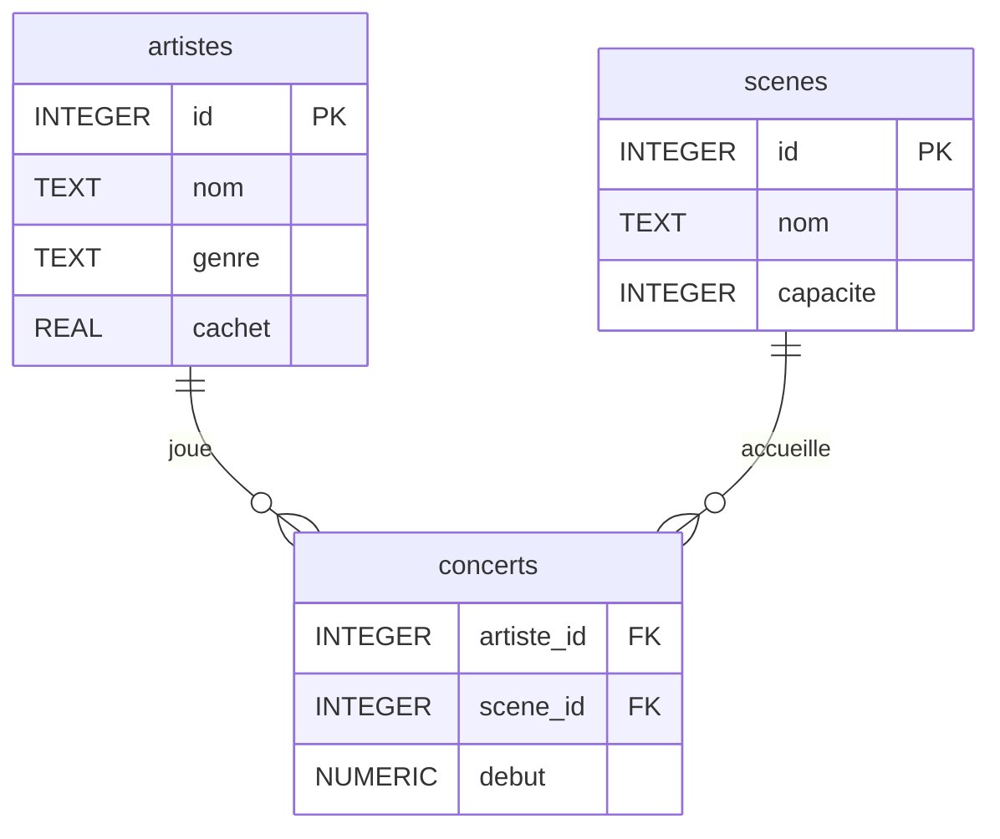

# Rappel

**Cours 1** — Interroger (`SELECT`, `WHERE`, `ORDER BY`, …)

**Cours 2** — Relier (`JOIN`, clés étrangères, relations)

**Aujourd'hui** — Concevoir une base de données **depuis zéro**

On va créer des tables, choisir des types, poser des contraintes.

---

# Notre projet

On va modéliser un **festival de musique** 🎶

On doit pouvoir représenter :

- les **artistes** qui jouent au festival
- les **scènes** sur lesquelles ils jouent
- les **concerts** (quel artiste, sur quelle scène, quand)

---

# `.schema`

Avant de créer, rappelons comment **voir** le schéma d'une base existante.

```sql
.schema
```

Affiche les commandes `CREATE TABLE` de toutes les tables.

Pour une seule table :

```sql
.schema artistes
```

---

# Première tentative

Tout dans une seule table :

| id  | artiste     | genre | cachet | scene        | capacite | debut            |
| --- | ----------- | ----- | ------ | ------------ | -------- | ---------------- |
| 1   | PLK         | Rap   | 45000  | Grande Scène | 5000     | 2025-07-10 20:00 |
| 2   | Jorja Smith | R&B   | 60000  | Grande Scène | 5000     | 2025-07-10 22:00 |
| 3   | PLK         | Rap   | 45000  | Chapiteau    | 800      | 2025-07-11 18:00 |
| 4   | SDM         | Rap   | 35000  | Chapiteau    | 800      | 2025-07-11 20:00 |

Quels problèmes voyez-vous ?

---

# Problèmes de redondance

- « PLK / Rap / 45000 » est écrit **2 fois**
  → si son cachet change, il faut modifier plusieurs lignes
- « Grande Scène / 5000 » est dupliqué
  → si la capacité change, même problème
- Si on supprime le dernier concert d'un artiste, on perd aussi ses infos

**Solution** → séparer chaque entité dans sa propre table

Ce processus s'appelle la **normalisation**.

---

# Normalisation

**Principe** : chaque entité a sa propre table.

Nos entités :

- **artistes** → `id`, `nom`, `genre`, `cachet`
- **scenes** → `id`, `nom`, `capacite`
- **concerts** → relie un artiste à une scène + horaire

Les infos sur un artiste restent dans `artistes`.
Les infos sur une scène restent dans `scenes`.
La table `concerts` ne fait que **relier** les deux.

---

# Relations

Un artiste peut jouer sur **plusieurs** scènes.

Une scène peut accueillir **plusieurs** artistes.

C'est une relation **many-to-many** (plusieurs à plusieurs).

On a besoin d'une **table de jonction** : `concerts`

---

# Diagramme entité-relation



`concerts` contient les **clés étrangères** vers les deux autres tables.

---

# Types de données (Storage Classes)

SQLite a **5 classes de stockage** :

| Classe    | Description                                         |
| --------- | --------------------------------------------------- |
| `NULL`    | valeur vide, absence de donnée                      |
| `INTEGER` | nombre entier (1, 42, -7)                           |
| `REAL`    | nombre décimal (3.14, 0.99)                         |
| `TEXT`    | chaîne de caractères ("PLK")                        |
| `NUMERIC` | entier ou décimal selon la valeur (type par défaut) |
| `BLOB`    | données binaires (image, audio, …)                  |

---

# Quel type pour le cachet ?

Réfléchissons ensemble.

- `INTEGER` → `45000` ✅ clair, pas de centimes à gérer
- `TEXT` → `"45 000 €"` ❌ impossible de calculer la somme des cachets
- `REAL` → `45000.00` 🤷 marche mais les flottants sont imprécis

→ `REAL` est le choix courant pour des montants,
mais `INTEGER` (en centimes) est plus précis si on veut éviter les erreurs d'arrondi.

---

# Quel type pour la capacité ?

- `INTEGER` → `5000` ✅ clair et on peut calculer
- `TEXT` → `"5000 places"` ❌ difficile de comparer ou additionner
- `REAL` → `5000.0` 🤷 pas faux mais inutilement décimal

→ `INTEGER` est le bon choix ici.

---

# Affinité de type

En SQLite, une colonne n'est pas **strictement** typée.

Elle a une **affinité** : elle _essaie_ de convertir la valeur.

Exemple :

- Colonne `INTEGER` → on insère `"25"` (texte) → stocké comme `25`
- Colonne `TEXT` → on insère `25` (entier) → stocké comme `"25"`

Les 5 affinités : `TEXT`, `NUMERIC`, `INTEGER`, `REAL`, `BLOB`

---

# INTEGER vs NUMERIC

|           | `INTEGER`           | `NUMERIC`        |
| --------- | ------------------- | ---------------- |
| `42`      | → entier ✅         | → entier ✅      |
| `3.14`    | → entier ❌ tronqué | → décimal ✅     |
| `"hello"` | → garde le texte    | → garde le texte |

`NUMERIC` = le couteau suisse, il choisit au cas par cas.

`INTEGER` = "je veux des entiers, point."

💡 Si on ne précise **aucun type**, SQLite utilise `NUMERIC` par défaut.

---

# Le fichier schema.sql

On écrit notre schéma dans un **fichier** `schema.sql`
plutôt que de taper les commandes une par une.

Avantages :

- on peut **relire** et **modifier** facilement
- on peut **partager** le schéma
- on peut **recréer** la base en une commande

Deux options pour éditer ce fichier :

- **Terminal** → `nano schema.sql` ou `vim schema.sql`
- **DB Browser for SQLite** → onglet "Execute SQL"

---

# schema.sql — CREATE TABLE

```sql
CREATE TABLE "artistes" (
    "id" INTEGER,
    "nom" TEXT,
    "genre" TEXT,
    "cachet" REAL
);

CREATE TABLE "scenes" (
    "id" INTEGER,
    "nom" TEXT,
    "capacite" INTEGER
);

CREATE TABLE "concerts" (
    "artiste_id" INTEGER,
    "scene_id" INTEGER,
    "debut" NUMERIC
);
```

---

# Exécuter le schéma

**Option terminal** — en deux temps :

```bash
sqlite3 festival.db
```

```sql
.read schema.sql
```

**Option DB Browser** — ouvrir `festival.db`, onglet "Execute SQL",
copier-coller le contenu de `schema.sql`, puis ▶️ Run.

---

# Question : pourquoi NUMERIC pour `debut` ?

Le type `NUMERIC` peut stocker des **dates et heures**.

SQLite n'a pas de type `DATE` dédié — il stocke les dates
comme du texte ou des nombres, selon le format.

`NUMERIC` gère les deux cas.

---

# Question : et les booléens ?

SQLite n'a **pas** de type booléen.

On utilise des entiers : `0` = faux, `1` = vrai.

Exemple — est-ce que la scène est couverte ?

```sql
"couverte" INTEGER  -- 0 ou 1
```

---

# Contraintes de table

On peut ajouter des **règles** sur nos tables.

Deux contraintes essentielles :

| Contrainte    | Rôle                                         |
| ------------- | -------------------------------------------- |
| `PRIMARY KEY` | identifiant unique de chaque ligne           |
| `FOREIGN KEY` | valeur qui doit exister dans une autre table |

---

# On met à jour le schéma — DROP TABLE

On veut ajouter des clés, mais les tables existent déjà.

Il faut les **supprimer** d'abord pour les recréer :

```sql
DROP TABLE "concerts";
DROP TABLE "scenes";
DROP TABLE "artistes";
```

⚠️ On supprime `concerts` **en premier** car elle référence
les autres tables via ses clés étrangères.

`.schema` → plus rien. On peut recréer.

---

# Ajoutons les clés

```sql
CREATE TABLE "artistes" (
    "id" INTEGER,
    "nom" TEXT,
    "genre" TEXT,
    "cachet" REAL,
    PRIMARY KEY("id")
);
```

```sql
CREATE TABLE "scenes" (
    "id" INTEGER,
    "nom" TEXT,
    "capacite" INTEGER,
    PRIMARY KEY("id")
);
```

---

# Table de jonction avec clés étrangères

```sql
CREATE TABLE "concerts" (
    "artiste_id" INTEGER,
    "scene_id" INTEGER,
    "debut" NUMERIC,
    FOREIGN KEY("artiste_id") REFERENCES "artistes"("id"),
    FOREIGN KEY("scene_id") REFERENCES "scenes"("id")
);
```

`concerts` n'a pas de clé primaire explicite.

→ SQLite en crée une **implicitement** : le `rowid`

---

# Clé primaire composée ?

On pourrait faire :

```sql
PRIMARY KEY("artiste_id", "scene_id")
```

Mais ça empêcherait un artiste de jouer **deux fois**
sur la même scène (samedi ET dimanche par exemple).

→ On ne le fait pas ici.

---

# Contraintes de colonne

SQLite a **4 contraintes de colonne** :

| Contrainte | Rôle                                   |
| ---------- | -------------------------------------- |
| `NOT NULL` | interdit les valeurs vides             |
| `UNIQUE`   | chaque valeur doit être différente     |
| `DEFAULT`  | valeur par défaut si rien n'est fourni |
| `CHECK`    | vérifie une condition sur la valeur    |

---

# Contraintes sur les artistes

```sql
CREATE TABLE "artistes" (
    "id" INTEGER,
    "nom" TEXT NOT NULL,
    "genre" TEXT,
    "cachet" REAL NOT NULL CHECK("cachet" > 0),
    PRIMARY KEY("id")
);
```

- `nom` est `NOT NULL` → on exige un nom d'artiste
- `genre` peut être `NULL` → pas toujours facile à classifier !
- `CHECK("cachet" > 0)` → un artiste est payé, pas bénévole

---

# Contraintes sur les scènes

```sql
CREATE TABLE "scenes" (
    "id" INTEGER,
    "nom" TEXT NOT NULL UNIQUE,
    "capacite" INTEGER NOT NULL CHECK("capacite" > 0),
    PRIMARY KEY("id")
);
```

- `NOT NULL UNIQUE` → chaque scène a un nom, et il est unique
- `CHECK("capacite" > 0)` → une scène a au moins 1 place

💡 `PRIMARY KEY` inclut déjà `NOT NULL` et `UNIQUE` —
pas besoin de le répéter pour `id`.

---

# Contraintes sur les concerts

```sql
CREATE TABLE "concerts" (
    "artiste_id" INTEGER,
    "scene_id" INTEGER,
    "debut" NUMERIC NOT NULL DEFAULT CURRENT_TIMESTAMP,
    FOREIGN KEY("artiste_id") REFERENCES "artistes"("id"),
    FOREIGN KEY("scene_id") REFERENCES "scenes"("id")
);
```

- `NOT NULL` → chaque concert a une date de début
- `DEFAULT CURRENT_TIMESTAMP` → si on ne précise pas, c'est maintenant

---

# ALTER TABLE — faire évoluer le schéma

Le festival grandit ! On veut vendre des **billets** 🎟️

D'abord, ajoutons un type de concert :

```sql
ALTER TABLE "concerts"
ADD COLUMN "type" TEXT;
```

Vérifions : `.schema concerts`

---

# Renommer, supprimer une colonne

Renommer :

```sql
ALTER TABLE "concerts"
RENAME COLUMN "type" TO "format";
```

Supprimer :

```sql
ALTER TABLE "concerts"
DROP COLUMN "format";
```

Renommer une table entière :

```sql
ALTER TABLE "concerts" RENAME TO "programmation";
```

---

# Nouvelles entités : festivaliers & billets

```sql
CREATE TABLE "festivaliers" (
    "id" INTEGER,
    "nom" TEXT NOT NULL,
    "email" TEXT NOT NULL UNIQUE,
    PRIMARY KEY("id")
);
```

```sql
CREATE TABLE "billets" (
    "id" INTEGER,
    "festivalier_id" INTEGER,
    "concert_id" INTEGER,
    "prix" REAL NOT NULL CHECK("prix" >= 0),
    "date_achat" NUMERIC NOT NULL DEFAULT CURRENT_TIMESTAMP,
    PRIMARY KEY("id"),
    FOREIGN KEY("festivalier_id") REFERENCES "festivaliers"("id"),
    FOREIGN KEY("concert_id") REFERENCES "concerts"("id")
);
```

---

# CHECK avec IN

On peut limiter les valeurs possibles :

```sql
"type" TEXT NOT NULL CHECK("type" IN ('concert', 'dj set', 'showcase'))
```

C'est équivalent à :

```sql
CHECK("type" = 'concert' OR "type" = 'dj set' OR "type" = 'showcase')
```

`IN` est plus lisible quand il y a beaucoup de valeurs.

---

# Recréer la base depuis le fichier

Bonne pratique : tout est dans `schema.sql`.

```bash
rm festival.db
sqlite3 festival.db < schema.sql
```

Ou depuis sqlite3 :

```sql
.read schema.sql
```

On modifie le fichier → on recrée la base. Simple et propre.

---

# Résumé — Mots-clés du jour

| Mot-clé        | Rôle                           |
| -------------- | ------------------------------ |
| `CREATE TABLE` | créer une table                |
| `DROP TABLE`   | supprimer une table            |
| `ALTER TABLE`  | modifier une table existante   |
| `PRIMARY KEY`  | identifiant unique             |
| `FOREIGN KEY`  | référence vers une autre table |
| `NOT NULL`     | valeur obligatoire             |
| `UNIQUE`       | pas de doublon                 |
| `DEFAULT`      | valeur par défaut              |
| `CHECK`        | condition sur les valeurs      |

---

# Résumé — Types

| Classe    | Exemples                                |
| --------- | --------------------------------------- |
| `NULL`    | rien                                    |
| `INTEGER` | `1`, `42`, `5000`                       |
| `REAL`    | `3.14`, `45000.00`                      |
| `TEXT`    | `'PLK'`, `'Grande Scène'`               |
| `NUMERIC` | dates, entiers ou décimaux selon valeur |
| `BLOB`    | images, fichiers audio                  |

---

# Projet — Médiathèque 📚

**Objectif** : concevoir et construire la base de données
d'une médiathèque, **depuis zéro**.

Mettez-vous en **groupes** (taille libre).

Commencez par réfléchir :

- Quelles **entités** ? (livres, adhérents, emprunts, auteurs, …)
- Quelles **colonnes** pour chaque entité ?
- Quelles **relations** entre les entités ?
- Quels **types** et quelles **contraintes** ?

Écrivez votre `schema.sql` et créez votre base `mediatheque.db`.

On continuera la semaine prochaine avec `INSERT`, `UPDATE`, `DELETE`
pour la remplir avec des données.
